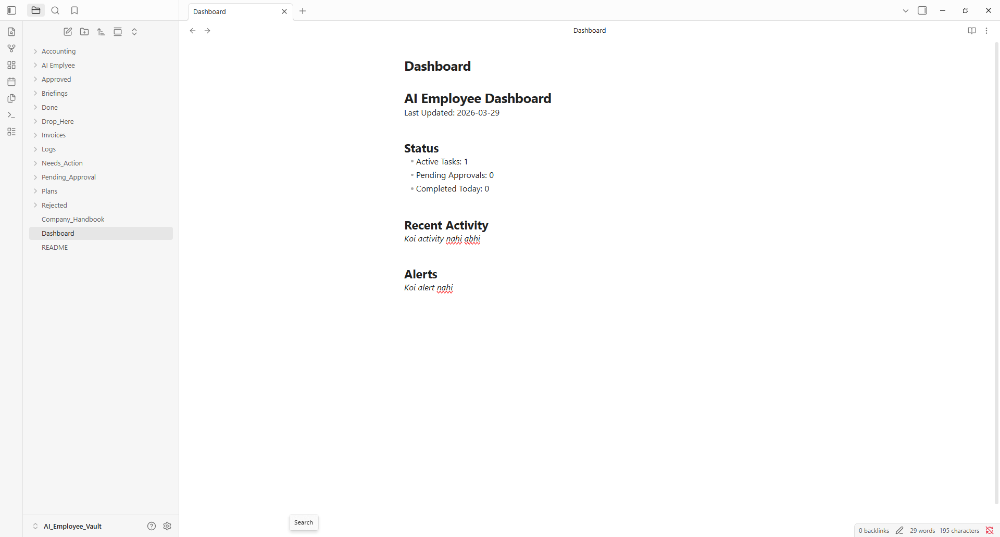
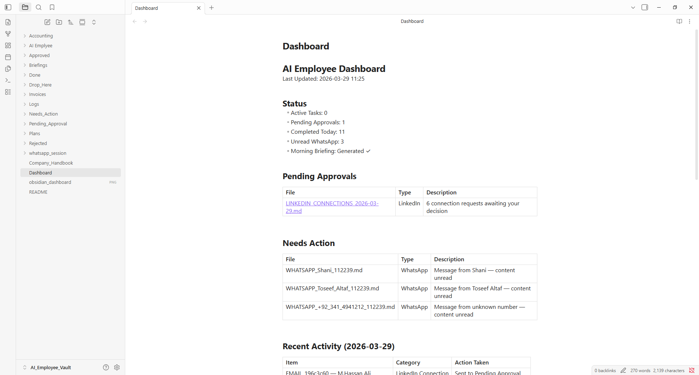
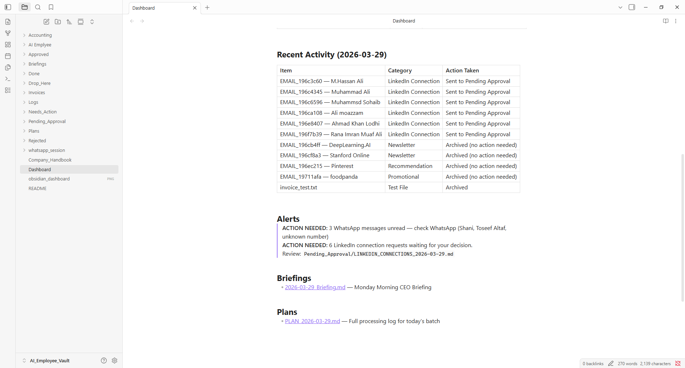

# Silver Tier AI Employee

> A local-first Personal AI Employee that monitors Gmail, WhatsApp,
> and automates daily tasks using Claude Code + Obsidian.

## Features
- Gmail Watcher — monitors important/unread emails
- WhatsApp Watcher — detects urgent messages
- File System Watcher — monitors Drop_Here folder
- Task Scheduler — daily 8AM briefing + weekly audit
- Claude Code integration — reads, thinks, plans, acts
- Human-in-the-Loop — approval system for sensitive actions
- Obsidian Dashboard — real-time status viewer

## Architecture
\\\
Gmail/WhatsApp/Files
        |
   Watcher Scripts (Python)
        |
   Needs_Action/ folder
        |
   Claude Code (Brain)
        |
   Plans/ + Pending_Approval/ + Dashboard.md
        |
   Human Approval → Done/
\\\

## Tech Stack
- Brain: Claude Code
- Dashboard: Obsidian (Local Markdown)
- Watchers: Python + Watchdog + Playwright
- Email: Google Gmail API
- Scheduler: Python Schedule library
- OS: Windows 11

## Folder Structure
\\\
AI_Employee_Vault/
├── Needs_Action/       # Pending tasks for Claude
├── Plans/              # Claude generated plans
├── Done/               # Completed tasks
├── Logs/               # Audit trail
├── Pending_Approval/   # Awaiting human decision
├── Approved/           # Human approved
├── Rejected/           # Human rejected
├── Accounting/         # Financial records
├── Briefings/          # CEO morning briefings
├── Drop_Here/          # Drop files to trigger AI
├── Dashboard.md        # Live status
└── Company_Handbook.md # AI rules of engagement
\\\

## Setup

### Prerequisites
\\\
Python 3.13+
Node.js v24+
Claude Code
Obsidian v1.10.6+
Google Cloud account (Gmail API)
\\\

### Install Dependencies
\\\powershell
pip install watchdog playwright schedule google-auth google-auth-oauthlib google-auth-httplib2 google-api-python-client
python -m playwright install chromium
\\\

### Gmail Setup
1. Google Cloud Console mein project banao
2. Gmail API enable karo
3. OAuth credentials download karo
4. credentials.json vault mein rakho

### Run
\\\powershell
# Terminal 1 - File Watcher
python filesystem_watcher.py

# Terminal 2 - Gmail Watcher
python gmail_watcher.py

# Terminal 3 - WhatsApp Watcher
python whatsapp_watcher.py

# Terminal 4 - Scheduler
python scheduler.py

# Terminal 5 - Claude Code
cd AI_Employee_Vault
claude
\\\

## How It Works
1. Watchers continuously monitor Gmail, WhatsApp, and local files
2. New items are saved as .md files in Needs_Action/
3. Claude Code reads and processes these files
4. Plans are created in Plans/ folder
5. Sensitive actions go to Pending_Approval/ for human review
6. Dashboard.md is updated in real-time
7. Completed tasks move to Done/

## Screenshots

## Security
- No credentials stored in code
- All data stays local
- Human approval for payments and new contacts
- Full audit logs in Logs/ folder

## Hackathon
Built for: Personal AI Employee Hackathon 0
Tier: Silver
By: Haider

## More Screenshots

### Screenshot 1

### Screenshot 2

